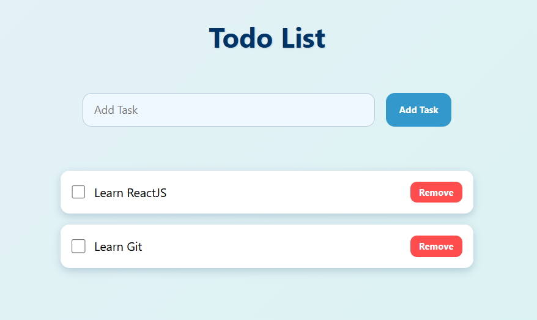

# 📝 TodoList - React Project

This is a simple **Todo List** project built with **React** and the `useState` hook, focused on practicing **modern JavaScript**, **React fundamentals**, and **styling using CSS Modules**.

<br/>

## ✨ Features

- ✅ Add tasks
- ❌ Remove tasks
- ✔️ Mark tasks as completed
- 🎯 Responsive and clean UI styled with CSS Modules
- 🌙 Modern design with shadows and hover effects

<br/>

## 🚀 Technologies Used

- [React](https://reactjs.org/)
- JavaScript (ES6+)
- CSS Modules
- Vite

<br/>

## 📷 Preview

 

## 💻 How to Run the Project

1. Clone the repository:

```bash
# Clone the repository
git clone https://github.com/diasmurillo/Todo-List.git

# Navigate into the project folder
cd Todo-List

# Install dependencies
npm install

# Run the development server
npm run dev